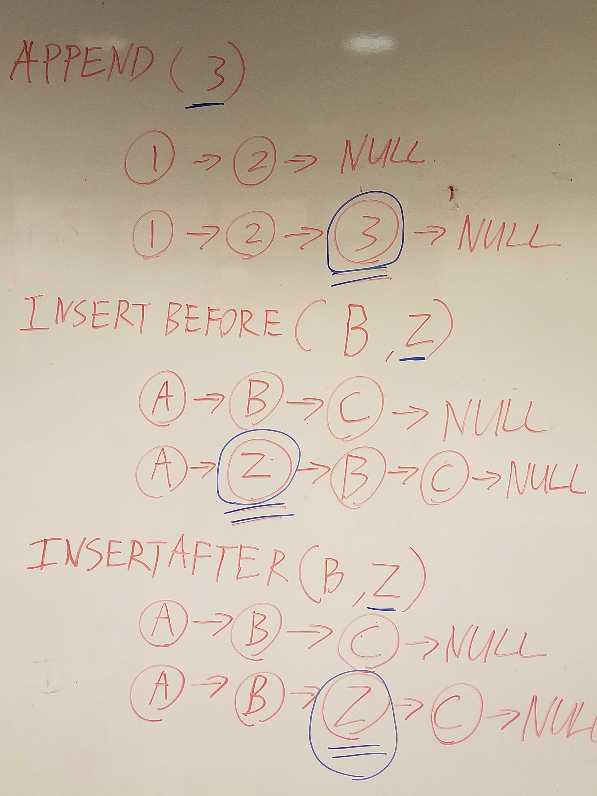

# Linked-Lists-Insertions

## Challenge

<!-- Description of the challenge -->
Write the following methods for the Linked List class:

### append

arguments: new value
adds a new node with the given value to the end of the list

### insert before

arguments: value, new value
adds a new node with the given new value immediately before the first node that has the value specified

### insert after

arguments: value, new value
adds a new node with the given new value immediately after the first node that has the value specified

### Structure and Testing

Utilize the Single-responsibility principle: any methods you write should be clean, reusable, abstract component parts to the whole challenge. You will be given feedback and marked down if you attempt to define a large, complex algorithm in one function definition.

You have access to the Node class and all the properties on the Linked List class.

Write tests to prove the following functionality:

- Can successfully add a node to the end of the linked list
- Can successfully add multiple nodes to the end of a linked list
- Can successfully insert a node before a node located i the middle of a linked list
- Can successfully insert a node before the first node of a linked list
- Can successfully insert after a node in the middle of the linked list
- Can successfully insert a node after the last node of the linked list

## Whiteboard Process

<!-- Embedded whiteboard image -->

## Approach & Efficiency

<!-- What approach did you take? Discuss Why. What is the Big O space/time for this approach? -->

Worked with Jeffrey Smith to write the code.

Run [npm test code-challenge06] to run tests.
